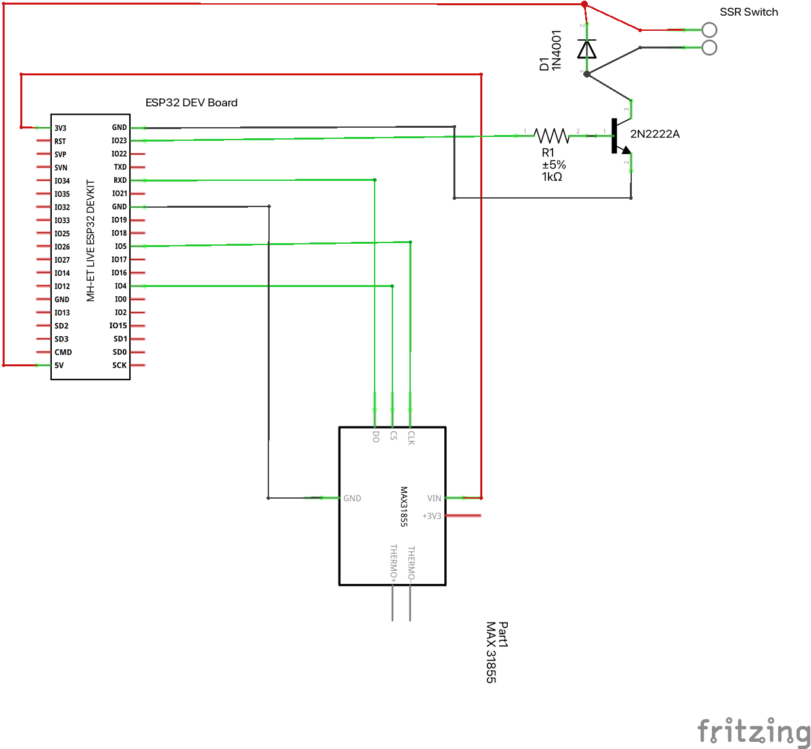
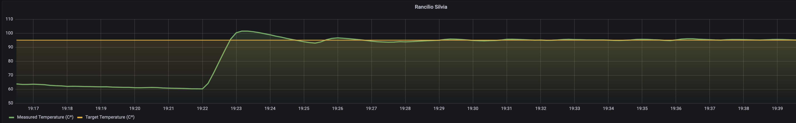

# ESPressIoT-ESP32

This project is a fork of the original ESPressIoT project by Roman
Schmit originally written for an  ESP3866 board with a TSIC
sensor. This fork ports that code to an ESP32 with a MAX31855
amplified K thermocouple.

The project covers somewhat advances features for an espresso machine
controller. The basic idea was to have reproducible "espresso results"
due to temperature regulation and being able to fine-tune. Especially
small machines have a low heat capacity and quality suffers a lot from
different heat-up-times and high hysteresis in standard temperature
switches.

This work is based on Roman's previous work with with IoT, MQTT and his
small controller [cofcon](https://github.com/Schm1tz1/cofcon). As
always - take care, you are working with high voltages and you are
switching loads up to a few Kilowatts. Please be sure yo know what you
are doing, always disconnect and unplug you machine before installing
electronics components, choose your components (cables, connectors,
sensors, SSR etc.) wisely...

## Dependencies
* [Arduino-PID-Library v1][1] 
* Espresso Machine (Gaggic CC, Rancilio Silvia etc.)
* ESP32 dev board (I used  the ESP32 NodeMCU Module WLAN WiFi Development Board met CP2102 )
* [ArduinoJSON v6][2]
* a suitable temperature sensor (This code uses the MAX31855 with the
  [Adafruit-MAX31855][3] library)
* [ArduinoStreamUtils][4]
* a SSR which is capable of switching your heater, has a low trigger threshold and does not draw too much current (otherwise you will toast your ESP8266)
* some electronics skills

## Features
* very fast and accurate adaptive PID-Controller for the heater of your espresso machine (heat-up-time about 2 minutes, stability/RMS of ~0.15 °C)
* WWW-Interface for control, configuration and tuning
* Telnet-Server for PID status (analogous to serial terminal)
* MQTT-Interface (needs [PubSub-Client][5])
* OTA-Flash enabled (over-the-air, flash firmware via upload in WWW-Interface)
* Serial Interface for testing, debugging
* JSON-Config in internal SPIFFS (uses [ArduinoJSON][2])
* Re-Written auto-tuning-loop to optimize PID parameters
* integrated simulation to test features and functionality

## Hardware setup

For the hardware setup I followed the example from [Bnayalivne's
Instructable](https://www.instructables.com/PID-Controlled-Thermostat-Using-ESP32-Applied-to-a/
"Bnayalivne's Instructable page") page. I used[ a
splitter](images/Splitter.jpg "image showing the splitter") to solder
a USB charger to. And the whole circuit I installed in the space
behind the frontplate, in a [small mayonnaise
container](images/ERP32-in-plastic-box.jpg)o keep it dry from the drip
plate.

Whilst the Fotek should be able to handle the 3.3 V output from the
GPIO it failed doing so. The small circuit with the transistor, resistor, and the
diode (against flowback) uses the GPIO defined in heater.ino  to switch the 5V output.
 

Finally, here is a graph of the PID kicking into action.

[1]: https://github.com/br3ttb/Arduino-PID-Library
[2]: https://github.com/bblanchon/ArduinoJson 
[3]: https://github.com/adafruit/Adafruit-MAX31855-library
[4]: https://github.com/bblanchon/ArduinoStreamUtils/
[5]: https://github.com/knolleary/pubsubclient

